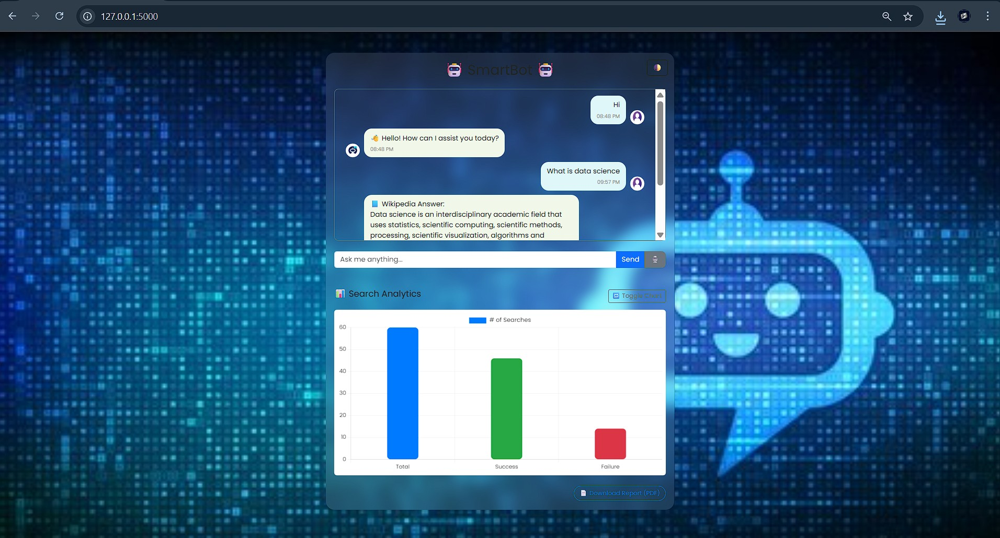

# 🤖 SmartBot - AI Chatbot with Search & Analytics

SmartBot is a friendly AI-powered chatbot that fetches information from **Wikipedia** and provides a **Google search fallback**. It features a modern web UI, voice-to-text input, dark/light themes, and live analytics with data visualizations. You can also generate a downloadable **PDF report** of search activity.

---

## ✨ Features

- 🗣️ Chat with human-like greetings and responses
- 🔍 Smart search: Uses Wikipedia → Google fallback
- 🎤 Voice-to-text input (browser-based)
- 🌗 Toggle theme (dark/light for chat window)
- 📊 Live analytics with bar and pie charts
- 📥 Downloadable PDF report with data visualizations
- 📦 Built with Flask, Bootstrap, Chart.js, and Matplotlib

---

## 📸 Screenshot



---

## 📁 Project Structure
```
smartbot/
|   analytics.py
|   app.py
|   chatbot_logic.py
|   plot_generator.py
|   report_generator.py
|   requirements.txt
|
+---data
|       chat_logs.json
|
+---static
|   |   search_report.pdf
|   |
|   +---css
|   |       style.css
|   |
|   +---images
|   |       bot-icon.jpg
|   |       robot-chatbot.jpg
|   |       user-icon.jpg
|   |
|   +---js
|   |       script.js
|   |
|   \---reports
|           analytics_report.pdf
|           bar_chart.png
|           pie_chart.png
|
+---templates
|       index.html
|
\---__pycache__
        analytics.cpython-313.pyc
        chatbot_logic.cpython-313.pyc
        plot_generator.cpython-313.pyc
        report_generator.cpython-313.pyc
```

## 📦 Technologies Used
Flask – Backend framework

Wikipedia API – Query knowledge base

Matplotlib – Charts for analytics

FPDF – Generate PDF reports

Bootstrap 5 – Responsive web design

Chart.js – Frontend visualizations

## 📄 License
This project is licensed under the MIT License. See [LICENSE](LICENSE) for details.

## 📫 Contact 
Feel free to reach out via the contact form on the site or email me at :  
[](https://www.linkedin.com/in/satya-vinayak-e-65636033b)
[](https://github.com/Satyavinayak-E)
[](mailto:satyavinayakerragunta@gmail.com)
